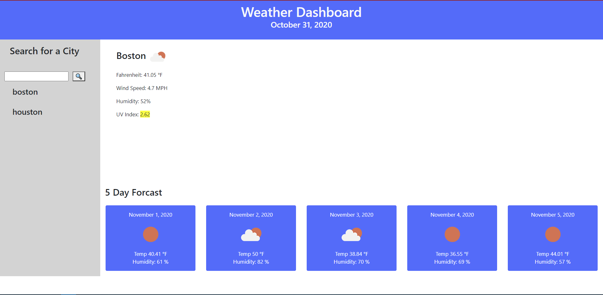

# Weather App

[Weather App Link ](https://ewager1.github.io/Weather-App/)

## Goal

To create a Weather App with the following criteria:

- generates weather for the current day
- generates weather for the next 5 days
- to display understanding of third party API's
- Weather can be searched by Town

## Outcome

-Weather app achieves prerequistites except for search history linking back to that town's weather.

## Things I was happy with

I was able to learn a lot about ajax and how third party API's work.

## Challenges I faced

1. I ran out of homework time and didn't finish the prerequisite for save data calling the AJAX api data back. I would make each saved item clickable and set up the ajax request based on the town name saved in local storage.

2. I wasn't happy with my planning in the project. I defintely forced my way through the first half, then by the time i really knew what I was doing, i
   had already written a lot of code innefficiently. The most glaring being that i have a default section and an input section that are almost the same. I could create clean functions that could be called in each with a couple different variable and probably save 100 lines of code. I knew it a couple days ago but had to balance time here with my other project. I'm hoping to correct this and re-submit a project I'm more proud of.
